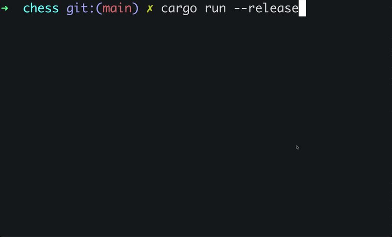

# Rust Chess Engine with Terminal UI

A high-performance chess engine written in Rust, featuring an interactive terminal-based interface.

## Features

### Game Modes

* **2-Player** — local human vs. human
* **1-Player Mode** — human vs. engine
* **0-Player Mode** — engine vs. engine demonstration:



### Engine Capabilities

* Complete legal move generation
* Position evaluation and move selection

---

### Building:

```bash
cargo build --release
```

### Running:

```bash
cargo run --release
```

### Testing:

```bash
cargo test --release
```

Testing with debugging and console output enabled:

```bash
cargo test --release -- --nocapture
```